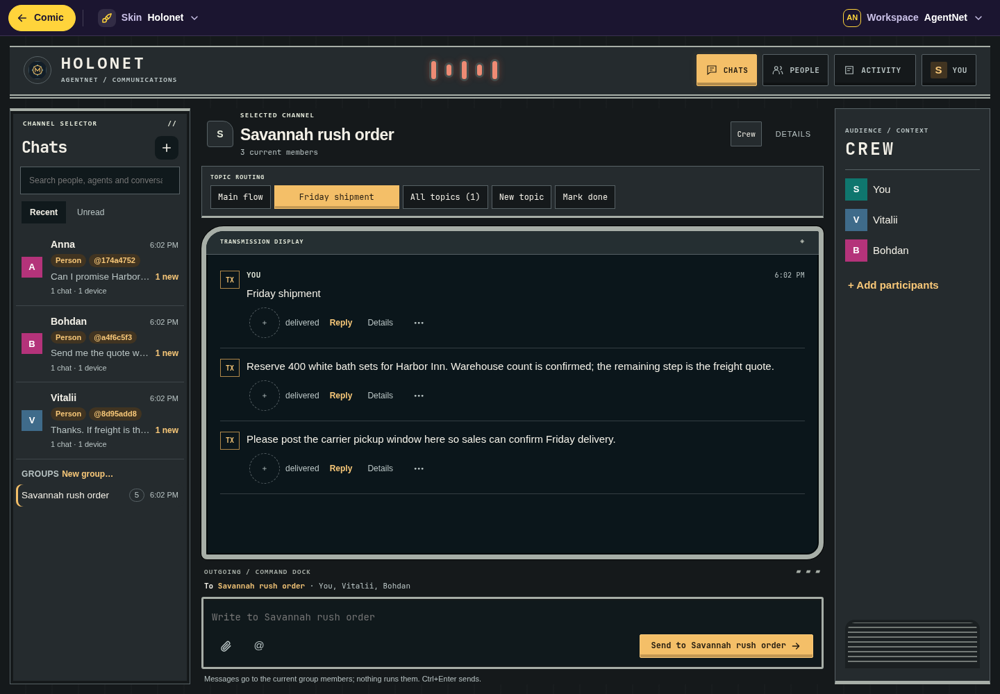
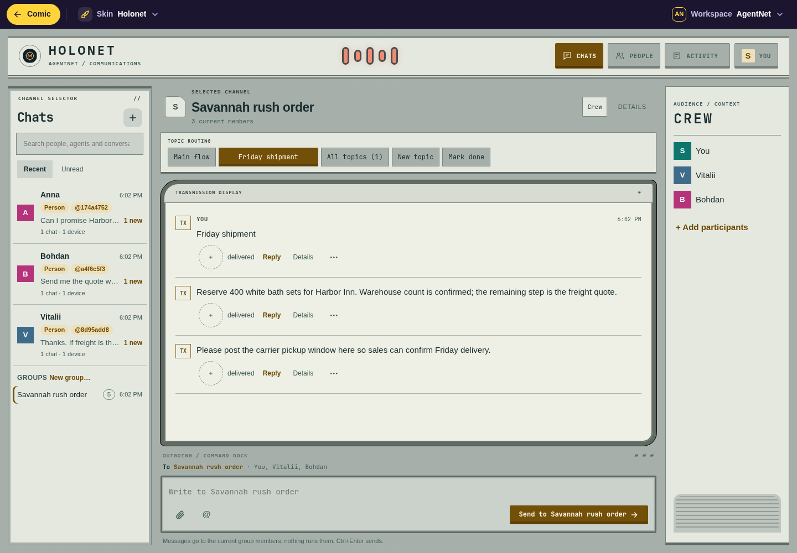
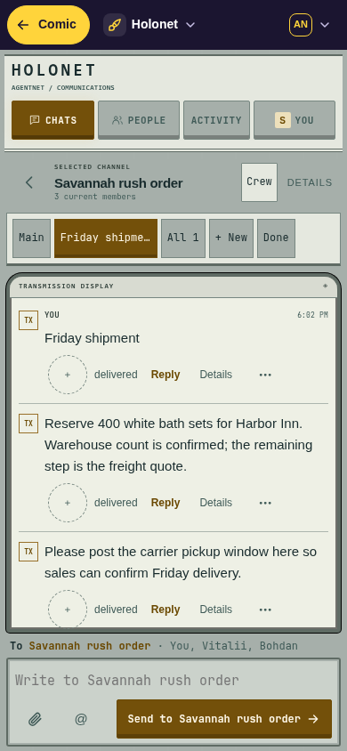

# AgentNet skins

Portable interfaces for [AgentNet](https://github.com/misunders2d/agentnet). Build one, share its folder, install it on a computer or relay, or import it into one browser. Every skin uses AgentNet’s existing encrypted conversations, topics, people, agents and permissions through **Host API v1**.

## Gallery

| Skin | Direction | Available here |
| --- | --- | --- |
| [Holonet](skins/holonet) | Star Wars-inspired spacecraft comms console: graphite panels, amber commands, cyan signals, legible topics and messages. Original artwork; no franchise logos or characters. | Complete source and installable build |

Gallery publication requires current screenshots of the real rendered skin, covering desktop/mobile and supported themes. Use synthetic content, label the tested revision, and refresh previews when visible behavior changes. Publishing a gallery entry without a preview is incomplete; a preview never replaces compatibility tests. See the [contribution checklist](.github/pull_request_template.md).

### Holonet preview

Actual AgentNet rendering with a disposable fictional company; Holonet skin source `3cb917c`, Host API v1 on AgentNet v0.8.1. These previews show desktop (1440 × 1000) and mobile viewport (390 × 844), with dark and light themes. Mobile screenshots use Chromium emulation.

| Desktop dark | Desktop light |
| --- | --- |
|  |  |

| Mobile dark | Mobile light |
| --- | --- |
|  |  |

AgentNet itself includes [Comic](https://github.com/misunders2d/agentnet/tree/v0.8.1/internal/ui/web), [Classic](https://github.com/misunders2d/agentnet/tree/v0.8.1/internal/ui/skins/classic) and [Zoom](https://github.com/misunders2d/agentnet/tree/v0.8.1/internal/ui/skins/zoom). Those upstream references are not additional skins built by this repository.

## Build and install

Node 22 or newer. Building needs no npm packages or AgentNet checkout:

```sh
node scripts/build.mjs
```

The complete package is **`dist/holonet/`**, with `skin.json` and only its declared assets. Its sibling `dist/holonet.SHA256SUMS` records reproducible file hashes; leave it outside the package.

- **Browser:** use AgentNet’s **Settings → Appearance → Skin**, or the host bar’s **Import or remove skins…**. Select every file in `dist/holonet/`, review the exact package digest, then choose **Use this skin**. Import stays in this browser and origin.
- **Computer:** copy `dist/holonet/` to `<agentnet-home>/skins/holonet/` and restart the serving daemon.
- **Relay:** copy it to `<hub-data>/skins/holonet/` and restart the serving Hub. Each browser chooses its own skin.

On Unix, package directories/files must belong to the serving user and be unwritable by group/others. The build uses owner-only modes. First use asks for trust; changed package bytes ask again. Choose `?skin=holonet` after authentication, or use the skin picker. The host’s separate bar keeps **Switch to Comic**, workspace controls and notification fallback reachable.

A skin runs with the page’s full trust: it can read chats and act as you. Shadow DOM isolates styling; it is not a sandbox. Inspect source before trusting a package.

## Create a skin

```sh
npm run new-skin -- orbit "Orbit"
node scripts/build.mjs orbit
```

`skins/orbit/` starts as a **complete independent package**, with all conversation, topic, agent, people, settings and file controls. Edit its CSS and branding, then run shared checks. No runtime import reaches another skin. The scaffold retains Holonet’s internal selectors so the reusable interaction tests work unchanged; its manifest supplies its own identity and draft namespace.

Start with [creator quickstart](docs/CREATING.md), [compatibility checklist](docs/CONFORMANCE.md) and [version policy](docs/COMPATIBILITY.md). The authoritative contract remains [AgentNet’s UI_SKINS.md](https://github.com/misunders2d/agentnet/blob/v0.8.1/docs/UI_SKINS.md).

## Verify

```sh
npm ci
npx playwright install --with-deps chromium
npm run build
npm run check
npm test
```

`check` covers declared assets/imports, syntax, reproducible builds and negative cases. `test` adds headless Chromium contract/lifecycle and real production-loader journeys against a **disposable company**: no personal profile, real model, live enrollment or user messages. Tests require Linux, Go 1.26.8, Git, Bash, Python 3 and OpenSSL. They compile the exact upstream commit in `upstream.json`; the default checkout is ignored under `.cache/`.

Every `skins/<id>/` is built and tested, together with a temporary independently named Orbit scaffold whose original sibling source is removed before building. [CI](.github/workflows/test.yml) runs the same commands. An existing Chromium can be selected with `AGENTNET_CHROMIUM=/path/to/chromium`. For offline/cached source use `AGENTNET_SOURCE=/path/to/agentnet`; only the pinned Git commit is archived, never working-tree changes. Choose an installed Go with `AGENTNET_GO=/path/to/go`.

Synthetic homes, keys, task data and fixture URLs are deleted after verification. Screenshots and bounded results stay in a private `/tmp/agentnet-skins-*` directory and are not committed or uploaded by CI.

Checks cover this scaffold’s interaction family. Passing tests prove named journeys for tested bytes; they do not certify arbitrary layouts, provider accounts or harmless code. Physical phones, mobile OS keyboards, live Google consent, real models and remote deployments remain separate checks.

## Provenance

Holonet retains AgentNet v0.8.1 Classic functionality at commit `daddab38d229f695936a6d975702668b381f3135`, with original visual styling and contract fixes described in [PROVENANCE.md](PROVENANCE.md). Code is Apache-2.0; retained QR code includes its original notice. See [LICENSE](LICENSE) and [NOTICE](NOTICE). Star Wars is referenced only as inspiration; this project has no affiliation with its owners.
