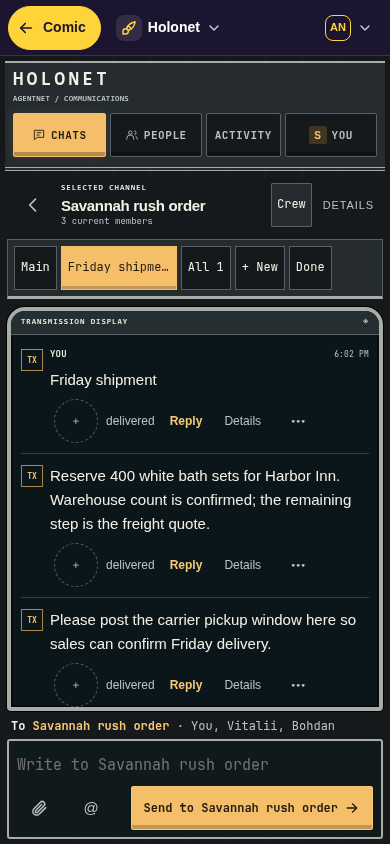

# Holonet

A Star Wars-inspired AgentNet comms console, using original artwork and system fonts. Horizontal command navigation, a topic console, a framed transmission port, a composer command dock and a readable crew panel make the cockpit composition distinct. Gunmetal/ivory surfaces, red structural lights and amber instruments use original CSS and SVG. Light mode uses a warm pale instrument-panel palette.

Topic/conversation changes trigger a brief acquisition sweep. Settings/details/crew open through decorative split shutters. Both effects are interruptible; content, keyboard focus and drafts remain immediately available. Reduced motion opens stable content without animation. Empty crew consoles collapse rather than inventing participants.

Complete Classic-derived interface, not a chat demo: people and groups, agents, topics, activity/decisions, profile/devices, notification preferences, file previews/downloads, settings, optional project-space/setup controls and guarded native-app actions. Effects remain AgentNet’s authority; unavailable capabilities are omitted or explained. Host fallback handles workspace administration and destinations the skin does not take.

## Preview

Actual AgentNet rendering with a disposable fictional company; Holonet cockpit skin source `c11e612`, Host API v1 on AgentNet v0.8.1. These previews show desktop (1440 × 1000) and mobile viewport (390 × 844), with dark and light themes. Mobile screenshots use Chromium emulation.

| Desktop dark | Desktop light |
| --- | --- |
|  |  |

| Mobile dark | Mobile light |
| --- | --- |
|  |  |

[Watch the topic sweep and split-shutter transitions](previews/transitions.mp4) — captured from the running skin, with no animation delaying interaction. Reduced-motion mode skips these effects.

Build: `node scripts/build.mjs holonet` from repository root. Install/import `dist/holonet/` as described in the [main README](../../README.md).

Targets Host API v1, pinned AgentNet v0.8.1. No code, images or imports require a sibling skin, CDN or external network service. Holonet always starts with its dark direction for System mode; explicit Light and Dark choices remain available. Unsent drafts are namespaced by manifest identity and workspace; staged files are retired after reconnect rather than replayed.
